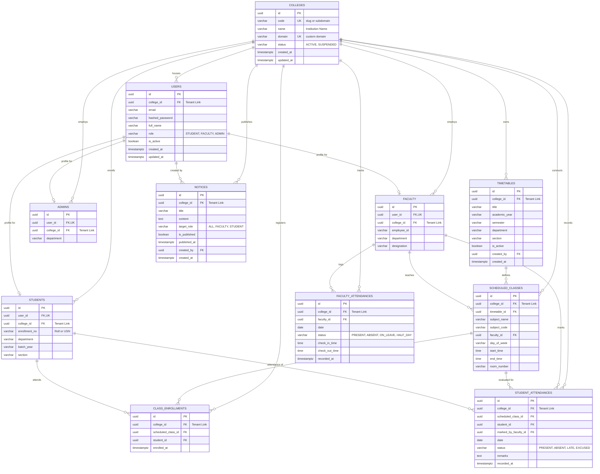

# Colexa — Multi-Tenant Database Architecture & Schema Specification

## 1. Architectural Overview & Tenant Isolation Model

Colexa utilizes a **Single-Database, Shared-Schema Architecture** with hardware-enforced institutional boundaries via PostgreSQL **Row-Level Security (RLS)**.

* **Tenant Root Entity (`colleges`)**: Every tenant-owned table maintains an explicit, indexed foreign key (`college_id`) referencing `colleges(id) ON DELETE CASCADE`.
* **Zero Data Leakage Guarantee**: PostgreSQL RLS policies evaluate `app.current_college_id` on every transaction, physically prohibiting cross-tenant reads or writes even in the event of an application-layer bug.
* **Per-Tenant Composite Uniqueness**: Institutional business identifiers (e.g., student enrollment numbers, employee IDs, and user login emails) are constrained uniquely per college: `UNIQUE (college_id, email)`, preventing collisions across institutions.

---

## 2. Mermaid.js Entity-Relationship (ER) Diagram



---

## 3. Schema Data Dictionary

### 3.1 `colleges` (Tenant Root Entity)
*Stores institution registrations and tenant root metadata.*

| Column | Data Type | Nullable | Key / Constraint | Description |
|---|---|---|---|---|
| `id` | `UUID` | No | `PRIMARY KEY, DEFAULT gen_random_uuid()` | Unique tenant identifier |
| `code` | `VARCHAR(50)` | No | `UNIQUE` | Tenant slug for subdomain routing (e.g. `mit`, `oxford`) |
| `name` | `VARCHAR(255)` | No | — | Formal institutional title |
| `domain` | `VARCHAR(255)` | Yes | `UNIQUE` | Dedicated custom domain (e.g. `portal.mit.edu`) |
| `status` | `VARCHAR(20)` | No | `DEFAULT 'ACTIVE'` | Operational status (`ACTIVE`, `SUSPENDED`) |
| `created_at` | `TIMESTAMPTZ` | No | `DEFAULT NOW()` | Record registration timestamp |
| `updated_at` | `TIMESTAMPTZ` | No | `DEFAULT NOW()` | Last update timestamp |

---

### 3.2 `users` (Core Identity & Access)
*Unified login credentials partitioned per college.*

| Column | Data Type | Nullable | Key / Constraint | Description |
|---|---|---|---|---|
| `id` | `UUID` | No | `PRIMARY KEY, DEFAULT gen_random_uuid()` | User identifier |
| `college_id` | `UUID` | No | `FOREIGN KEY REFERENCES colleges(id) ON DELETE CASCADE` | **Tenant Anchor** |
| `email` | `VARCHAR(255)` | No | — | Login email |
| `hashed_password` | `VARCHAR(255)` | No | — | Argon2id / bcrypt password hash |
| `full_name` | `VARCHAR(150)` | No | — | Full legal name |
| `role` | `VARCHAR(20)` | No | `CHECK (role IN ('STUDENT', 'FACULTY', 'ADMIN'))` | Role-based identity |
| `is_active` | `BOOLEAN` | No | `DEFAULT TRUE` | Active account status flag |
| `created_at` | `TIMESTAMPTZ` | No | `DEFAULT NOW()` | Account creation timestamp |
| `updated_at` | `TIMESTAMPTZ` | No | `DEFAULT NOW()` | Last update timestamp |

* **Unique Constraints & Indexes**:
  * `UNIQUE (college_id, email)`: Enables different colleges to have duplicate generic email prefixes without conflict.
  * `INDEX idx_users_tenant_role (college_id, role, is_active)`.

---

### 3.3 `students` (Student Profile Extension)
*Academic details extending the base user entity for student actors.*

| Column | Data Type | Nullable | Key / Constraint | Description |
|---|---|---|---|---|
| `id` | `UUID` | No | `PRIMARY KEY, DEFAULT gen_random_uuid()` | Student record identifier |
| `user_id` | `UUID` | No | `FOREIGN KEY REFERENCES users(id) ON DELETE CASCADE, UNIQUE` | 1-to-1 account link |
| `college_id` | `UUID` | No | `FOREIGN KEY REFERENCES colleges(id) ON DELETE CASCADE` | **Tenant Anchor** |
| `enrollment_no`| `VARCHAR(60)` | No | — | Roll number / USN / Student Registration ID |
| `department` | `VARCHAR(100)` | No | — | Academic branch (e.g. Computer Science) |
| `batch_year` | `VARCHAR(20)` | No | — | Admission batch (e.g. `2024-2028`) |
| `section` | `VARCHAR(10)` | No | — | Class section / cohort (e.g. `A`, `B`) |

* **Unique Constraints & Indexes**:
  * `UNIQUE (college_id, enrollment_no)`: Prevents duplicate enrollment numbers within a single college.
  * `INDEX idx_students_cohort (college_id, department, batch_year, section)`.

---

### 3.4 `faculty` (Faculty Profile Extension)
*Institutional details extending the base user entity for faculty actors.*

| Column | Data Type | Nullable | Key / Constraint | Description |
|---|---|---|---|---|
| `id` | `UUID` | No | `PRIMARY KEY, DEFAULT gen_random_uuid()` | Faculty record identifier |
| `user_id` | `UUID` | No | `FOREIGN KEY REFERENCES users(id) ON DELETE CASCADE, UNIQUE` | 1-to-1 account link |
| `college_id` | `UUID` | No | `FOREIGN KEY REFERENCES colleges(id) ON DELETE CASCADE` | **Tenant Anchor** |
| `employee_id` | `VARCHAR(60)` | No | — | Institutional employee code |
| `department` | `VARCHAR(100)` | No | — | Academic department |
| `designation` | `VARCHAR(100)` | No | — | Faculty title (e.g. Associate Professor) |

* **Unique Constraints & Indexes**:
  * `UNIQUE (college_id, employee_id)`: Enforces unique employee codes per college.
  * `INDEX idx_faculty_tenant_dept (college_id, department)`.

---

### 3.5 `admins` (Admin Profile Extension)
*Metadata extending the base user entity for administrative actors.*

| Column | Data Type | Nullable | Key / Constraint | Description |
|---|---|---|---|---|
| `id` | `UUID` | No | `PRIMARY KEY, DEFAULT gen_random_uuid()` | Admin record identifier |
| `user_id` | `UUID` | No | `FOREIGN KEY REFERENCES users(id) ON DELETE CASCADE, UNIQUE` | 1-to-1 account link |
| `college_id` | `UUID` | No | `FOREIGN KEY REFERENCES colleges(id) ON DELETE CASCADE` | **Tenant Anchor** |
| `department` | `VARCHAR(100)` | Yes | — | Administrative office/department |

---

### 3.6 `timetables` (Class Schedule Header)
*Schedule groups defined by administrators.*

| Column | Data Type | Nullable | Key / Constraint | Description |
|---|---|---|---|---|
| `id` | `UUID` | No | `PRIMARY KEY, DEFAULT gen_random_uuid()` | Timetable identifier |
| `college_id` | `UUID` | No | `FOREIGN KEY REFERENCES colleges(id) ON DELETE CASCADE` | **Tenant Anchor** |
| `title` | `VARCHAR(150)` | No | — | Descriptive title (e.g. `CS 5th Sem 2026`) |
| `academic_year`| `VARCHAR(20)` | No | — | Year bracket (e.g. `2026-2027`) |
| `semester` | `VARCHAR(10)` | No | — | Semester index (e.g. `5`) |
| `department` | `VARCHAR(100)` | No | — | Branch |
| `section` | `VARCHAR(10)` | No | — | Section label |
| `is_active` | `BOOLEAN` | No | `DEFAULT TRUE` | Active schedule status |
| `created_by` | `UUID` | No | `FOREIGN KEY REFERENCES users(id)` | Admin author |
| `created_at` | `TIMESTAMPTZ` | No | `DEFAULT NOW()` | Creation timestamp |

* **Indexes**: `INDEX idx_timetables_lookup (college_id, department, semester, section, is_active)`.

---

### 3.7 `scheduled_classes` (Class Period Slots)
*Specific class slots linking Course, Faculty, Day, and Timing.*

| Column | Data Type | Nullable | Key / Constraint | Description |
|---|---|---|---|---|
| `id` | `UUID` | No | `PRIMARY KEY, DEFAULT gen_random_uuid()` | Class period identifier |
| `college_id` | `UUID` | No | `FOREIGN KEY REFERENCES colleges(id) ON DELETE CASCADE` | **Tenant Anchor** |
| `timetable_id` | `UUID` | No | `FOREIGN KEY REFERENCES timetables(id) ON DELETE CASCADE` | Parent timetable |
| `subject_name` | `VARCHAR(150)` | No | — | Course name (e.g. Operating Systems) |
| `subject_code` | `VARCHAR(30)` | No | — | Course code (e.g. `CS502`) |
| `faculty_id` | `UUID` | No | `FOREIGN KEY REFERENCES faculty(id)` | Assigned faculty instructor |
| `day_of_week` | `VARCHAR(15)` | No | `CHECK (day_of_week IN ('MONDAY', 'TUESDAY', 'WEDNESDAY', 'THURSDAY', 'FRIDAY', 'SATURDAY'))` | Day of period |
| `start_time` | `TIME` | No | — | Start time (e.g. `09:00:00`) |
| `end_time` | `TIME` | No | — | End time (e.g. `10:00:00`) |
| `room_number` | `VARCHAR(50)` | No | — | Classroom / Laboratory |

* **Indexes**:
  * `INDEX idx_classes_faculty_schedule (college_id, faculty_id, day_of_week)`.
  * `INDEX idx_classes_timetable (college_id, timetable_id)`.

---

### 3.8 `class_enrollments` (Student Roster)
*Associates students with their respective scheduled classes.*

| Column | Data Type | Nullable | Key / Constraint | Description |
|---|---|---|---|---|
| `id` | `UUID` | No | `PRIMARY KEY, DEFAULT gen_random_uuid()` | Enrollment identifier |
| `college_id` | `UUID` | No | `FOREIGN KEY REFERENCES colleges(id) ON DELETE CASCADE` | **Tenant Anchor** |
| `scheduled_class_id` | `UUID` | No | `FOREIGN KEY REFERENCES scheduled_classes(id) ON DELETE CASCADE` | Class period reference |
| `student_id` | `UUID` | No | `FOREIGN KEY REFERENCES students(id) ON DELETE CASCADE` | Enrolled student reference |
| `enrolled_at` | `TIMESTAMPTZ` | No | `DEFAULT NOW()` | Date of enrollment |

* **Unique Constraints & Indexes**:
  * `UNIQUE (college_id, scheduled_class_id, student_id)`: Prevents duplicate roster entries.
  * `INDEX idx_enrollments_student_query (college_id, student_id)`.

---

### 3.9 `student_attendances` (Student Class Attendance)
*Recorded by faculty for each scheduled class session.*

| Column | Data Type | Nullable | Key / Constraint | Description |
|---|---|---|---|---|
| `id` | `UUID` | No | `PRIMARY KEY, DEFAULT gen_random_uuid()` | Attendance entry identifier |
| `college_id` | `UUID` | No | `FOREIGN KEY REFERENCES colleges(id) ON DELETE CASCADE` | **Tenant Anchor** |
| `scheduled_class_id` | `UUID` | No | `FOREIGN KEY REFERENCES scheduled_classes(id)` | Scheduled class reference |
| `student_id` | `UUID` | No | `FOREIGN KEY REFERENCES students(id) ON DELETE CASCADE` | Evaluated student |
| `marked_by_faculty_id` | `UUID` | No | `FOREIGN KEY REFERENCES faculty(id)` | Faculty member who took attendance |
| `date` | `DATE` | No | — | Attendance date |
| `status` | `VARCHAR(20)` | No | `CHECK (status IN ('PRESENT', 'ABSENT', 'LATE', 'EXCUSED'))` | Status marker |
| `remarks` | `TEXT` | Yes | — | Optional notes |
| `recorded_at` | `TIMESTAMPTZ` | No | `DEFAULT NOW()` | Submission timestamp |

* **Unique Constraints & Indexes**:
  * `UNIQUE (college_id, scheduled_class_id, student_id, date)`: Restricts each student to exactly one attendance mark per class per date.
  * `INDEX idx_student_att_summary (college_id, student_id, date)`.
  * `INDEX idx_student_att_class_date (college_id, scheduled_class_id, date)`.

---

### 3.10 `faculty_attendances` (Faculty Daily Check-In)
*Records faculty daily self-attendance.*

| Column | Data Type | Nullable | Key / Constraint | Description |
|---|---|---|---|---|
| `id` | `UUID` | No | `PRIMARY KEY, DEFAULT gen_random_uuid()` | Attendance entry identifier |
| `college_id` | `UUID` | No | `FOREIGN KEY REFERENCES colleges(id) ON DELETE CASCADE` | **Tenant Anchor** |
| `faculty_id` | `UUID` | No | `FOREIGN KEY REFERENCES faculty(id) ON DELETE CASCADE` | Faculty member |
| `date` | `DATE` | No | — | Attendance date |
| `status` | `VARCHAR(20)` | No | `CHECK (status IN ('PRESENT', 'ABSENT', 'ON_LEAVE', 'HALF_DAY'))` | Status marker |
| `check_in_time` | `TIME` | Yes | — | Arrival time |
| `check_out_time`| `TIME` | Yes | — | Departure time |
| `recorded_at` | `TIMESTAMPTZ` | No | `DEFAULT NOW()` | System timestamp |

* **Unique Constraints & Indexes**:
  * `UNIQUE (college_id, faculty_id, date)`: Exactly one attendance record per faculty per calendar day.
  * `INDEX idx_fac_att_daily (college_id, faculty_id, date)`.

---

### 3.11 `notices` (Announcements & Circulars)
*Admin notices published with audience role targeting.*

| Column | Data Type | Nullable | Key / Constraint | Description |
|---|---|---|---|---|
| `id` | `UUID` | No | `PRIMARY KEY, DEFAULT gen_random_uuid()` | Notice identifier |
| `college_id` | `UUID` | No | `FOREIGN KEY REFERENCES colleges(id) ON DELETE CASCADE` | **Tenant Anchor** |
| `title` | `VARCHAR(200)` | No | — | Notice headline |
| `content` | `TEXT` | No | — | Announcement body text |
| `target_role` | `VARCHAR(20)` | No | `CHECK (target_role IN ('ALL', 'FACULTY', 'STUDENT'))` | Role-based visibility |
| `is_published` | `BOOLEAN` | No | `DEFAULT TRUE` | Visibility state toggle |
| `published_at` | `TIMESTAMPTZ` | No | `DEFAULT NOW()` | Publication timestamp |
| `created_by` | `UUID` | No | `FOREIGN KEY REFERENCES users(id)` | Authoring Admin |
| `created_at` | `TIMESTAMPTZ` | No | `DEFAULT NOW()` | Record creation timestamp |

* **Indexes**: `INDEX idx_notices_feed (college_id, target_role, is_published, published_at DESC)`.

---

## 4. PostgreSQL Row-Level Security (RLS) Policy Declarations

```sql
-- Enable RLS across all tenant tables
ALTER TABLE users ENABLE ROW LEVEL SECURITY;
ALTER TABLE students ENABLE ROW LEVEL SECURITY;
ALTER TABLE faculty ENABLE ROW LEVEL SECURITY;
ALTER TABLE admins ENABLE ROW LEVEL SECURITY;
ALTER TABLE timetables ENABLE ROW LEVEL SECURITY;
ALTER TABLE scheduled_classes ENABLE ROW LEVEL SECURITY;
ALTER TABLE class_enrollments ENABLE ROW LEVEL SECURITY;
ALTER TABLE student_attendances ENABLE ROW LEVEL SECURITY;
ALTER TABLE faculty_attendances ENABLE ROW LEVEL SECURITY;
ALTER TABLE notices ENABLE ROW LEVEL SECURITY;

-- Tenant Isolation Policies
CREATE POLICY tenant_isolation_users ON users AS RESTRICTIVE
    USING (college_id = NULLIF(current_setting('app.current_college_id', true), '')::uuid);

CREATE POLICY tenant_isolation_students ON students AS RESTRICTIVE
    USING (college_id = NULLIF(current_setting('app.current_college_id', true), '')::uuid);

CREATE POLICY tenant_isolation_faculty ON faculty AS RESTRICTIVE
    USING (college_id = NULLIF(current_setting('app.current_college_id', true), '')::uuid);

CREATE POLICY tenant_isolation_admins ON admins AS RESTRICTIVE
    USING (college_id = NULLIF(current_setting('app.current_college_id', true), '')::uuid);

CREATE POLICY tenant_isolation_timetables ON timetables AS RESTRICTIVE
    USING (college_id = NULLIF(current_setting('app.current_college_id', true), '')::uuid);

CREATE POLICY tenant_isolation_classes ON scheduled_classes AS RESTRICTIVE
    USING (college_id = NULLIF(current_setting('app.current_college_id', true), '')::uuid);

CREATE POLICY tenant_isolation_enrollments ON class_enrollments AS RESTRICTIVE
    USING (college_id = NULLIF(current_setting('app.current_college_id', true), '')::uuid);

CREATE POLICY tenant_isolation_student_att ON student_attendances AS RESTRICTIVE
    USING (college_id = NULLIF(current_setting('app.current_college_id', true), '')::uuid);

CREATE POLICY tenant_isolation_fac_att ON faculty_attendances AS RESTRICTIVE
    USING (college_id = NULLIF(current_setting('app.current_college_id', true), '')::uuid);

CREATE POLICY tenant_isolation_notices ON notices AS RESTRICTIVE
    USING (college_id = NULLIF(current_setting('app.current_college_id', true), '')::uuid);
```
